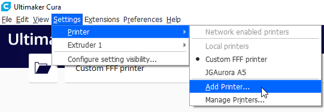
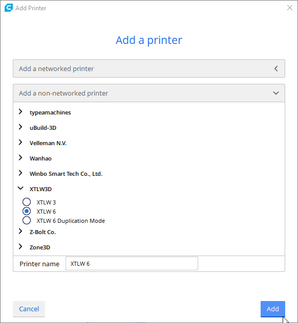
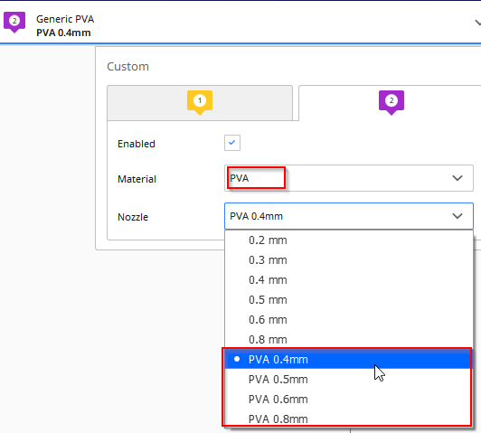

# Cura configuration for XTLW 6 and XTLW 3
This project contains the configuration files for the XTLW 6 IDEX and XTLW 3 3D printers for Cura 4.4.

The original files were provided by XTLW for Cura 3.6 and updated by me for the current Cura version 4.4

If the configuration is not working, a configuration is missing or something is wrong -> please open a issue and add as many information and the error or warning messages from the Cura logfile.

Feel free to contribute and add merge requests :-)

## Supported materials (filaments) and variants (nozzels)

### Materials
- Generic ABS 1.75 mm
- Generic PETG 1.75 mm
- Generic PLA 1.75 mm
- Generic PVA 1.75 mm

### Variants
Standard:
- 0.2 mm
- 0.3 mm
- 0.4 mm
- 0.6 mm
- 0.8 mm
  
PVA:
- 0.4 mm
- 0.5 mm
- 0.6 mm
- 0.8 mm

## Add configuration files to Cura
1. Open Cura and click ```Help -> Show Configuration Folder```  

2. Copy the following folders from ```configuration/``` to the Cura configuration folder
    - definitions
    - extruders
    - meshes
    - quality
    - variants 
3. Restart Cura
4. Add printer by clicking ```Settings -> Printer -> Add Printer...```  

5. Expand ```Add a non-network printer```, scroll down to ```XLTW3D``` and choose your printer.  
For the XLTW 6 there are one seperate printer for normal mode (both extruders available in Cura) and one for duplication mode (only one extruder available in Cura). This allows differnt configurations and bed sizes for different IDEX modes.  

6. After the printer(s) added, you can use the predefined settings for extruders and qualitys
7. XTLW recommends to choose a PVA nozzel for printing PVA material  


## Generate a new configuration set
This is not neccessary for the normal usage of the settings!

A new configuration can be generated by executing the ```quality_varaint_generator.py``` Python script from the ```generators``` directory. The generator overrides the files in the ```configuration/quality``` directory.  

The generator requires >= Python 3.8